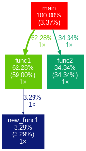
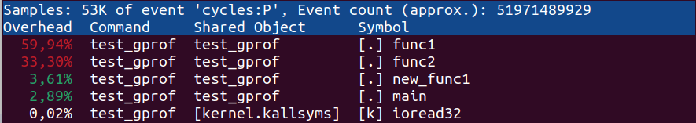

# Trabajo Práctico N°1: Rendimiento
## Cátedra de Sistemas de Computación, FCEFyN, UNC. 2025.
### Alumnos: Bernaus, Julieta; Di Pasquo, Franco; Viccini, Carlos Patricio.
### Profesor: Jorge, Javier.

## Introducción
En este informe, se utilizará el concepto de benchmarking para evaluar el rendimiento de diferentes CPU. En primer lugar, utilizaremos algunas de las herramientas de terceros disponibles en el mercado para evaluar el rendimiento de algunos procesadores. En segundo lugar, utilizaremos herramientas para obtener nuestros propios resultados.

## Desarrollo

| Tareas                       | Benchmarks                                                                                                           |
|------------------------------|----------------------------------------------------------------------------------------------------------------------|
| Ofimática                    | **PCMark 10**: es un sistema de evaluación comparativa para PC con Windows centrado en tareas ofimáticas modernas. Ofrece diversas cargas de trabajo clasificadas en cuatro grupos. El grupo Essentials incluye navegación web, videoconferencia y tiempo de arranque de aplicaciones. El grupo Productividad incluye pruebas basadas en hojas de cálculo y escritura. El grupo de Creación de Contenidos Digitales incluye edición de fotos, edición de vídeo y una prueba de renderizado y visualización. El último grupo, Juegos, incluye pruebas de gráficos en tiempo real y física. El benchmark PCMark 10 comprueba el rendimiento utilizando los grupos Essentials, Productivity y Digital Content Creation. La prueba PCMark 10 Express incluye los grupos Essentials y Productivity. La prueba PCMark 10 Extended incluye los grupos Essentials, Productivity, Digital Content Creation y Gaming. Elegimos éste porque realizamos principalmente tareas ofimáticas en Windows. |
| Video Call Streaming          | **Zoom Network Connectivity Tool (Meeting test)**: sirve para simular una video llamada. La herramienta probará e informará sobre cada uno de los siguientes elementos cuando la prueba esté completa: **Latencia (RTT)** Prueba el retraso en las comunicaciones entre el dispositivo y los servidores de Zoom. **Pérdida de Paquetes** Prueba el porcentaje de pérdida de paquetes de datos entre el dispositivo y los servidores de Zoom. **Jitter** Prueba la variación de latencia entre el dispositivo y los servidores de Zoom. **Códec** Enumera el códec de audio utilizado para enviar y recibir durante la prueba. **Frecuencia de Reloj (KHz)** |
| Programación                 | **Cinebench**: evalúa el rendimiento del CPU y sus cores.                                                            |
| Compilación                  | **Timed GCC Compilation Benchmark (Open Benchmarking)**: mide el tiempo de compilación de GCC, dependiendo del CPU y la memoria. |
| Videojuegos (Gaming)        | **3DMark**: Es una herramienta creada por UL Benchmarks para determinar el rendimiento de la renderización de gráficos 3D y la capacidad de procesamiento de la carga de trabajo de la CPU. Al ejecutar 3D Mark se obtiene una puntuación 3DMark normalizada, basada en los valores obtenidos del "GPU Score" y la "CPU Score", generando un "Overall Score".  |
| Edición de imágenes          | **Adobe Photoshop Benchmark**: Prueba de rendimiento utilizada para evaluar el desempeño de una computadora al ejecutar tareas en Adobe Photoshop. Utiliza diversas herramientas y recursos del sistema, incluyendo: **CPU** → Procesamiento de imágenes, filtros y efectos. **GPU** → Aceleración gráfica en ciertas tareas. **RAM** → Carga y manipulación de imágenes de gran tamaño. **Almacenamiento (SSD/HDD)** → Velocidad de lectura/escritura de archivos grandes. **Sistema Operativo** → Puede afectar el rendimiento según la optimización de controladores y administración de recursos. |

### Fórmulas
#### Rendimiento

$$T_{instruccion} = CPI * T_{CPU}$$
$$T_{prog} = N°instrucciones * CPI * T_{CPU}$$
$$\eta_{prog} = \frac{1}{T_{prog}}  = \frac{1}{N°instruc * CPI * T_{CPU}} = \frac{f_{CPU}}{N°instruc * CPI} s^{-1}$$

#### Desempeño
$$Speedup = \frac{Rendimiento mejorado}{Rendimiento original} = \frac{EX_{CPU original}}{EX_{CPU mejorado}}$$

#### Eficiencia
$$Eficiencia = \frac{Speedup_n}{n}$$

### Comparacion de rendimiento y desempaño entre procesadores al compilar el kernel de linux
#### Datos del benchmark de compilacion

| Procesador                              | Tiempo de Ejecución | Rendimiento Promedio |
|-----------------------------------------|---------------------|----------------------|
| Intel Core i5-13600K                   | 83 +/- 3            | 0,01205              |
| AMD Ryzen 9 5900X 12-Core               | 97 +/- 6            | 0,01031              |
| AMD Ryzen 9 7950X 16-Core               | 53 +/- 3            | 0,01887              |

#### Aceleracion comparada con AMD Ryzen 9 7950X 16-Core
| Procesador Base                       | Speedup Peor Caso | Speedup Mejor Caso |
|---------------------------------------|-------------------|---------------------|
| Intel Core i5-13600K                 | 1,4286            | 1,72                |
| AMD Ryzen 9 5900X 12-Core             | 1,625             | 2,06                |

### Time Profiling
Siguiendo el tutorial disponible, se obtuvieron los siguientes resultados, de acuerdo a cada uno de nuestros sistemas:
| Detalles del sistema                  | Tiempo total [s] | Tiempo main [s]| Tiempo func1 [s] | Tiempo func2 [s]| Tiempo newfunc [s] |
|---------------------------------------|-------------------|---------------------|---------------------|---------------------|---------------------|
| Intel Core i5-10210U @ 1.60GHz - 16GB RAM - 512 SSD   | 59 | 0.39 |6.82 |3.97|0.38|
| Intel Core i5-13450HX  × 16 - 512GB SSD - 16GB RAM  | 2.28 | 0.09 |1.32 |0.78|0.09|

Una de estas ejecuciones es visualizable en el siguiente gráfico generado con gprof2dot y graphviz : 

También se realizó el análisis con perf: 

Como se puede apreciar, los resultados son similares con ambas herramientas. Las mínimas diferencias se deben al código extra que es añadido por gprof para recolectar más información.

## Conclusiones
El desarrollo de este trabajo revelo las significativas diferencias en rendimiento que pueden surgir entre sistemas con hardware similar en papel, destacando la importancia que tiene una correcta configuración y optimización del software para aprovechar al máximo las diversas capacidades del hardware. 

La comparación entre las herramientas de profiling de tiempo **gprof** y **perf** puso en manifiesto que la elección entre ellas dependera de las necesidades del usuario: gprof ofreciendo una mayor cantidad de información, mientras que perf proporcionando mediciones mas resumidas pero tambien más precisas, de manera que inclinarse entre una u otra dependera meramente de que es lo que se busca.

Además, se logro la correcta comprendension y aplicacion las ecuaciones de **rendimiento**, **eficiencia** y **speedup**. Esto fue posible al analizar los distintos procesadores, facilitando la evaluación de sus capacidades en un contexto práctico y tangible. 

Finalmente, la diversidad de benchmarks disponibles demuestra que no existe una evaluacion única que defina _que tan bueno_ es un dispositivo; evidenciando que un sistema puede desempeñarse de manera excelente en ciertas tareas y ser muy ineficaz en otras, lo que resalta la importancia de seleccionar correctamente las pruebas adecuadas según los objetivos específicos de medición. En resumen, este análisis subraya la relevancia de un enfoque crítico y adaptado a las necesidades al evaluar el rendimiento de los sistemas computacionales.